# 实验报告

| 《大数据技术原理与应用》实验报告 | | | | |
|---|---|---|---|---|
| **题目：** Hadoop 集群的安装与配置 | | **姓名：** 陈嘉豪 | | **日期：** 2026/5/11 |
| **实验环境：** Ubuntu Kylin 16.04 LTS、VMWare Workstation、Hadoop 3.3.5、JDK 1.8.0_371 | | | | |

---

## 一、实验目的

1. 掌握 Linux 虚拟机的安装方法
2. 掌握常用的 Linux 命令操作
3. 掌握 Hadoop 的分布式安装与配置方法
4. 掌握 Hadoop 的常用操作（HDFS 文件操作、MapReduce 作业运行）
5. 掌握 Hadoop 完全分布式集群的搭建方法

---

## 二、实验环境

| 项目 | 配置 |
|------|------|
| 操作系统 | Ubuntu Kylin 16.04 LTS |
| 虚拟机软件 | VMWare Workstation 17 |
| Hadoop 版本 | 3.3.5 |
| JDK 版本 | JDK 1.8.0_371 |
| 集群规模 | 2 台虚拟机（1 Master + 1 Slave） |
| Master 节点 | 主机名：master，IP：192.168.88.128，角色：NameNode、ResourceManager |
| Slave 节点 | 主机名：slave1，IP：192.168.88.132，角色：DataNode、NodeManager |

---

## 三、实验内容与步骤

### 3.1 安装 Linux 虚拟机

在 VMWare Workstation 中创建两台 Ubuntu Kylin 16.04 LTS 虚拟机，配置硬盘 100GB（动态分配）、内存 8GB。安装完成后安装 VMware Tools 以支持共享文件夹和分辨率调整。

**遇到的问题：** 无法直接通过 VMWare Workstation 下载 VMware Tools；Ubuntu 访问 Windows FTP 服务器时中文文件名乱码。

**解决方法：** 通过 `sudo apt install filezilla -y` 安装 FileZilla，强制指定 GBK 编码连接 FTP，从 Download 目录获取 VMware Tools 安装包。共享文件夹无法使用时，改用 `scp` 命令在 Windows 宿主机和虚拟机之间传输文件。


---

### 3.2 熟悉常用的 Linux 操作（跟着文档练就完了这里不具体说明）

在终端中练习了 19 个常用 Linux 命令，包括：

| 类别 | 命令 |
|------|------|
| 目录操作 | `cd`、`ls -al`、`mkdir`、`rmdir` |
| 文件操作 | `cp`、`mv`、`rm`、`touch` |
| 查看内容 | `cat`、`tac`、`more`、`head`、`tail` |
| 权限管理 | `chown`、`chmod` |
| 其他 | `find`、`tar`、`grep`、环境变量配置 |

通过实际操作掌握了 Linux 文件系统的基本管理方法。

#### Linux 文件系统目录结构：

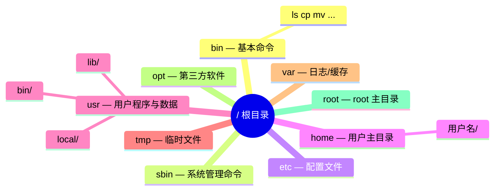


#### 文件操作命令关系图：

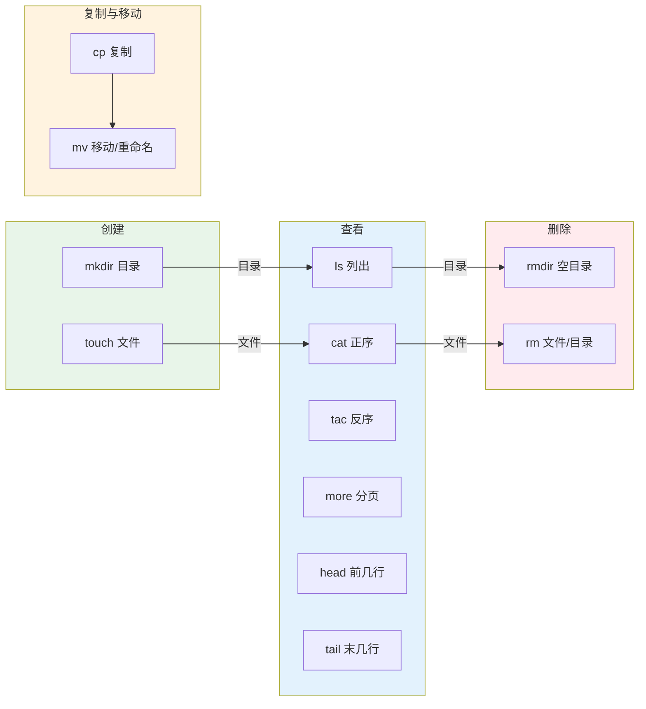


#### chmod 权限数字对照表：

| 数字 | 权限 | 含义           |
| ---- | ---- | -------------- |
| 7    | rwx  | 读 + 写 + 执行 |
| 6    | rw-  | 读 + 写        |
| 5    | r-x  | 读 + 执行      |
| 4    | r--  | 只读           |
| 0    | ---  | 无权限         |

> 示例：`chmod 754 file`
>
> - 所有者(7) = rwx
> - 所属组(5) = r-x
> - 其他(4) = r--

#### tar 压缩与解压流程：

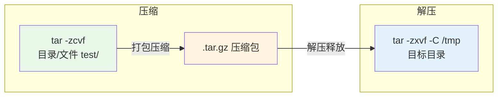


**参数说明：**

| 参数 | 含义               |
| ---- | ------------------ |
| z    | gzip 压缩          |
| c    | 创建 (create)      |
| x    | 解压 (extract)     |
| v    | 显示过程 (verbose) |
| f    | 指定文件名 (file)  |
| C    | 指定解压目标目录   |

#### 用户与权限管理：

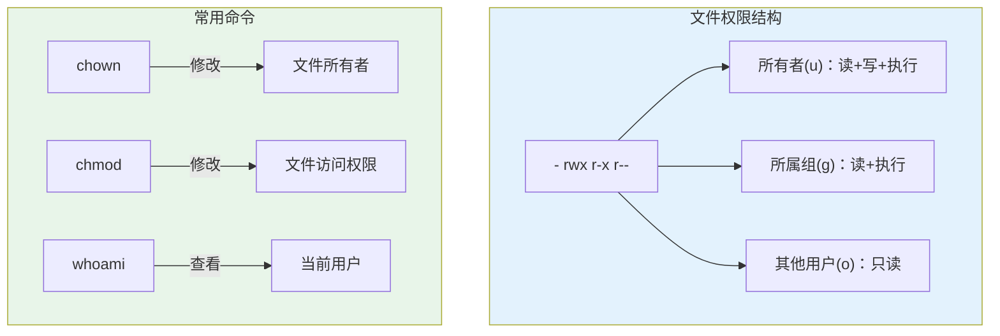


#### Linux 常用命令思维导图（Mermaid）：


---

### 3.3 进行 Hadoop 安装（这里也是跟着文档做就行，不具体说明）

#### （1）创建 hadoop 用户

```bash
sudo useradd -m hadoop -s /bin/bash
sudo passwd hadoop
sudo adduser hadoop sudo
```

#### （2）基础环境配置

更新 apt 并安装 vim：

```bash
sudo apt-get update
sudo apt-get install vim -y
```

**遇到的问题：** `apt update` 执行报错 `Connection failed` + `does not have a Release file`。原因是系统是 Ubuntu Kylin 16.04 LTS（Xenial），但 `sources.list` 里写的是 trusty（14.04）的旧源，版本不匹配。

**解决方法：**
```bash
# 解决 DNS 解析问题
echo "nameserver 114.114.114.114" | sudo tee /etc/resolv.conf

# 清除旧的 ubuntukylin 源
sudo rm -f /etc/apt/sources.list.d/*kylin*
sudo sed -i '/ubuntukylin/d' /etc/apt/sources.list

# 重新更新
sudo apt update
```

#### （3）安装 SSH 并配置免密登录

```bash
sudo apt-get install openssh-server -y
ssh-keygen -t rsa -C "hadoop@master"
cat ~/.ssh/id_rsa.pub >> ~/.ssh/authorized_keys
```

#### （4）安装 Java 环境

从 Windows 宿主机通过 `scp` 传输 JDK 安装包到虚拟机：

```bash
# 在 Windows 命令行执行
scp C:\Users\CJH\Desktop\VMware\Node_1\jdk-8u371-linux-x64.tar.gz hadoop@192.168.88.128:/home/hadoop/Downloads/
```

在虚拟机中解压并配置环境变量：

```bash
sudo mkdir -p /usr/lib/jvm
sudo tar -zxvf ~/Downloads/jdk-8u371-linux-x64.tar.gz -C /usr/lib/jvm
```

在 `~/.bashrc` 中添加：

```bash
export JAVA_HOME=/usr/lib/jvm/jdk1.8.0_371
export JRE_HOME=${JAVA_HOME}/jre
export CLASSPATH=.:${JAVA_HOME}/lib:${JRE_HOME}/lib
export PATH=${JAVA_HOME}/bin:$PATH
```

**遇到的问题：** `JAVA_HOME` 路径正确但运行时显示 `JAVA_HOME is not set and could not be found`。

**解决方法：** 在 `/usr/local/hadoop/etc/hadoop/hadoop-env.sh` 中将 `export JAVA_HOME=${JAVA_HOME}` 改为具体的路径 `export JAVA_HOME=/usr/lib/jvm/jdk1.8.0_371`。原因是 Hadoop 启动时读取的是 `hadoop-env.sh` 中的配置，而非系统环境变量。

#### （5）安装 Hadoop 3.3.5

```bash
sudo tar -zxvf ~/Downloads/hadoop-3.3.5.tar.gz -C /usr/local/
cd /usr/local
sudo mv hadoop-3.3.5 hadoop
sudo chown -R hadoop:hadoop ./hadoop
```

---

### 3.4 Hadoop 单机配置（非分布式）

Hadoop 默认以单机模式运行，无需额外配置。运行附带的 grep 示例：

```bash
cd /usr/local/hadoop
mkdir ./input
cp ./etc/hadoop/*.xml ./input
./bin/hadoop jar ./share/hadoop/mapreduce/hadoop-mapreduce-examples-3.3.5.jar grep ./input ./output 'dfs[a-z.]+'
cat ./output/*
```

成功输出 `dfsadmin` 出现 1 次。

---

### 3.5 Hadoop 伪分布式配置

#### （1）修改 core-site.xml

```xml
<configuration>
    <property>
        <name>hadoop.tmp.dir</name>
        <value>file:/usr/local/hadoop/tmp</value>
    </property>
    <property>
        <name>fs.defaultFS</name>
        <value>hdfs://localhost:9000</value>
    </property>
</configuration>
```

#### （2）修改 hdfs-site.xml

```xml
<configuration>
    <property>
        <name>dfs.replication</name>
        <value>1</value>
    </property>
    <property>
        <name>dfs.namenode.name.dir</name>
        <value>file:/usr/local/hadoop/tmp/dfs/name</value>
    </property>
    <property>
        <name>dfs.datanode.data.dir</name>
        <value>file:/usr/local/hadoop/tmp/dfs/data</value>
    </property>
</configuration>
```

#### （3）格式化并启动

```bash
cd /usr/local/hadoop
./bin/hdfs namenode -format
./sbin/start-dfs.sh
jps
```

验证显示 NameNode、DataNode、SecondaryNameNode 三个进程。

#### （4）运行伪分布式实例

```bash
./bin/hdfs dfs -mkdir -p /user/hadoop
./bin/hdfs dfs -mkdir input
./bin/hdfs dfs -put ./etc/hadoop/*.xml input
./bin/hadoop jar ./share/hadoop/mapreduce/hadoop-mapreduce-examples-3.3.5.jar grep input output 'dfs[a-z.]+'
./bin/hdfs dfs -cat output/*
```

成功在 HDFS 上运行 MapReduce 作业并查看结果。


---

### 3.6 Hadoop 安装流程图

#### 3.6.1整体安装流程（Mermaid）

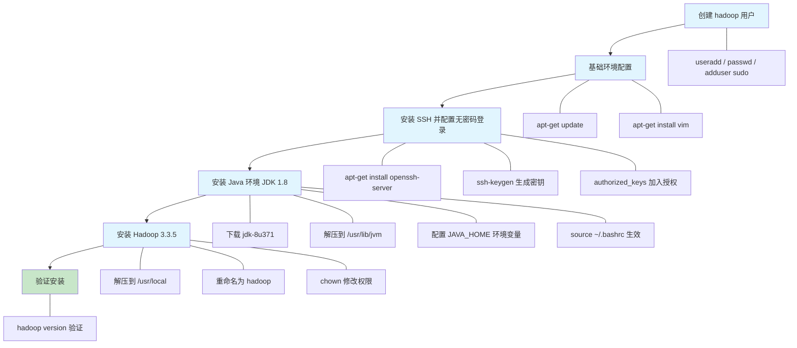


#### 3.6.2Hadoop 目录结构（Mermaid）

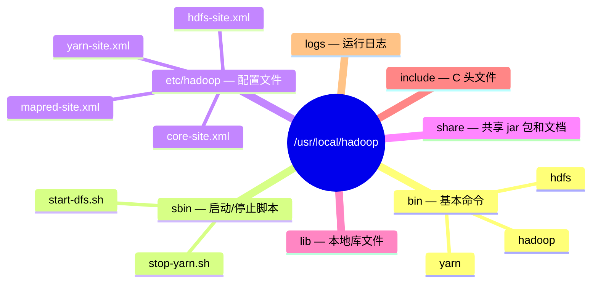


#### 3.6.3环境变量配置说明（Mermaid）

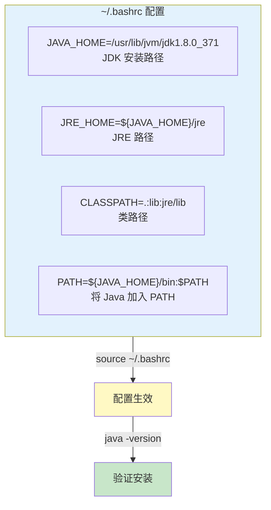


### 3.7 Hadoop 完全分布式配置（两台虚拟机）

#### （1）介绍

```txt
前面我们已经在 单节点 上完成了伪分布式配置，其中 NameNode、DataNode、SecondaryNameNode 都运行在同一台机器上。本节我们将搭建一个由两台虚拟机组成的 Hadoop 完全分布式集群，体会真正的分布式计算。我们后续使用$ ifconfig命令得到ip地址
```


- ##### 与伪分布式的区别：

  ```mermaid
  graph TB
      subgraph 伪分布式["伪分布式（单节点 localhost）"]
          NN1[NameNode<br/>端口:9000]
          DN1[DataNode<br/>端口:9866]
          SNN1[SecondaryNameNode<br/>端口:9868]
      end
  ```

  
  
  ```mermaid
  graph TB
      subgraph Master["Master 主节点 (192.168.88.128)"]
          NN[NameNode<br/>RPC:9000]
          SNN[SecondaryNameNode]
          RM[ResourceManager<br/>Web UI:8088]
      end
  
      subgraph Slave["Slave 从节点 (192.168.88.132)"]
          DN[DataNode<br/>端口:9866]
          NM[NodeManager]
      end
  
      Master -->|"SSH 管理"| Slave
      NN -->|"数据块管理"| DN
      RM -->|"任务调度"| NM
  
      style Master fill:#e1f5fe
      style Slave fill:#c8e6c9	
  ```
  
  
  
  | 对比项            | 伪分布式                | 完全分布式                 |
  | ----------------- | ----------------------- | -------------------------- |
  | 节点数量          | 1 台                    | 2 台（1 Master + 1 Slave） |
  | `fs.defaultFS`    | `hdfs://localhost:9000` | `hdfs://Master:9000`       |
  | `dfs.replication` | 1                       | 2                          |
  | `workers` 文件    | 不需要 / localhost      | 需要配置 Slave 主机名      |
  | SSH 免密登录      | localhost → localhost   | Master → Slave             |

#### （2）规划网络与主机名

假设两台虚拟机的网络规划如下（请根据实际 IP 修改）：

| 节点 | 主机名 | IP | 角色 |
|------|--------|-----|------|
| Master | master | 192.168.88.128 | NameNode、ResourceManager |
| Slave | slave1 | 192.168.88.132 | DataNode、NodeManager |

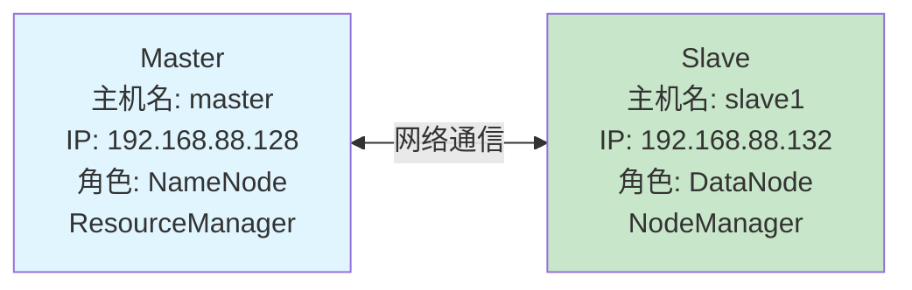


**修改主机名：**

**在 Master 上执行：**

```bash
$ sudo hostnamectl set-hostname master
```

**在 Slave 上执行：**

```bash
$ sudo hostnamectl set-hostname slave1
```

**配置 IP 与主机a名映射，在两台机器上配置 `/etc/hosts`：**

```bash
$ sudo vim /etc/hosts
```

**在文件末尾添加以下内容（注意删除或注释掉可能存在的其他同名映射）：**

```
192.168.88.128  master
192.168.88.132  slave1
```

> **说明：** 这一步的作用是让两台机器可以通过主机名（如 `master`、`slave1`）互相访问，而不需要每次都输入 IP 地址。这与伪分布式中使用 `localhost` 是类似的道理——只不过现在 `localhost` 换成了真实的主机名。

**配置完成后，可以用 `ping` 命令验证两台机器之间的连通性：**

```bash
# 在 Master 上测试
$ ping slave1 -c 3

# 在 Slave 上测试
$ ping master -c 3
```

#### （3）配置 SSH 免密登录

在伪分布式中，我们配置的是 `ssh localhost` 的免密登录。在完全分布式中，**Master 需要通过 SSH 免密登录到自己和所有 Slave**，这样在启动集群时才不需要反复输入密码。

> **为什么 Master 也要对自己免密？** `start-dfs.sh` 启动时会 SSH 到 `workers` 文件中列出的每个节点来启动 DataNode，同时也会 SSH 到 `master`（自己）来启动 NameNode 和 SecondaryNameNode。如果 Master→Master 的 SSH 免密没配，就会报 `Permission denied (publickey,password)`。

> **关于 `sign_and_send_pubkey: signing failed`：** 这是 Ubuntu 16.04 上最常见的 SSH 免密失败原因。即使你把公钥正确加入了 `authorized_keys`，如果没有启动 `ssh-agent` 并加载私钥，SSH 仍然会要求输入密码。**以下步骤严格按照顺序执行即可解决。**

**我遇到的问题：** 配置 Master→Master 和 Master→Slave 的 SSH 免密登录时，出现 `sign_and_send_pubkey: signing failed: agent refused operation` 错误。

**解决方法：** Ubuntu 16.04 默认不会自动启动 ssh-agent，需要手动启动并加载私钥：

```bash
eval "$(ssh-agent -s)"
ssh-add ~/.ssh/id_rsa
```

**完整操作流程：**

**清空两台节点的旧密钥（从头开始）**

如果之前配置过 SSH 免密但一直不成功，建议**先在两台机器上清空旧的 SSH 密钥**，再从头配置，避免旧密钥干扰。

**在 Master 上执行（清空 Master 本地的旧密钥）：**

```bash
# 杀掉旧的 ssh-agent 进程
$ killall ssh-agent 2>/dev/null

# 删除所有旧的 SSH 密钥文件
$ rm -rf ~/.ssh/id_rsa ~/.ssh/id_rsa.pub ~/.ssh/authorized_keys ~/.ssh/known_hosts

# 确认已清空
$ ls -la ~/.ssh/
# 应该只有 . 和 .. ，或者目录本身不存在
```

**在 Master 上通过 SSH 清空 Slave 的旧密钥（此时需要输入密码）：**

```bash
$ ssh hadoop@slave1 "killall ssh-agent 2>/dev/null; rm -rf ~/.ssh/id_rsa ~/.ssh/id_rsa.pub ~/.ssh/authorized_keys ~/.ssh/known_hosts; ls -la ~/.ssh/"
# 输入 Slave 上 hadoop 用户的密码
```

> **注意：** 执行完这一步后，两台机器之间的 SSH 免密登录会全部失效，后续操作都需要输入密码。这是正常的，接下来的步骤会重新配置免密。

**在 Master 上生成密钥**

```bash
$ ssh-keygen -t rsa -C "hadoop@master"
# 一路回车，不要设置密码（提示 Enter passphrase 时直接按回车）
```

**启动 ssh-agent 并加载私钥（关键步骤）**

> **这一步必须在配置免密之前做，否则后面 `ssh master` 会一直报 `sign_and_send_pubkey` 错误！**

```bash
# 启动 ssh-agent
$ eval "$(ssh-agent -s)"
# 输出类似：Agent pid 76576

# 将私钥加载到 agent
$ ssh-add ~/.ssh/id_rsa
# 输出：Identity added: /home/hadoop/.ssh/id_rsa
```

**如果 `ssh-add` 报错 `Could not open a connection to your authentication agent`，先杀掉旧进程再重启：**

```bash
$ killall ssh-agent
$ eval "$(ssh-agent -s)"
$ ssh-add ~/.ssh/id_rsa
```

**如果 `ssh-add` 报错 `@@@@@@@@@@@@@@@@@@@@@@@@@@@@@@@@@@@@@@@@@@@@@@@@@@@@@@@@@@@` 开头的权限错误，说明私钥文件权限不对：**

```bash
$ chmod 600 ~/.ssh/id_rsa
$ ssh-add ~/.ssh/id_rsa
```

> **为什么需要这一步？** `ssh-agent` 是一个后台程序，负责管理你的 SSH 私钥。当 SSH 连接需要签名认证时，它会请求 agent 来完成签名，而不是直接读取私钥文件。如果 agent 没有加载私钥，就会报 `agent refused operation`。Ubuntu 16.04 默认不会自动启动 ssh-agent，所以需要手动执行。

**配置 Master 对自己免密**

```bash
# 将 Master 的公钥加入自己的授权列表
$ cat ~/.ssh/id_rsa.pub >> ~/.ssh/authorized_keys

# 确保权限正确（权限不对会导致 SSH 仍然要求输入密码）
$ chmod 600 ~/.ssh/authorized_keys
$ chmod 700 ~/.ssh
```

**验证：**

```bash
$ ssh master
# 应该无需输入密码即可登录（注意是 ssh master，不是 ssh localhost）
$ exit
```

> **注意：** 必须用 `ssh master` 测试，而不是 `ssh localhost`。因为 Hadoop 启动脚本是通过主机名 `master` 来 SSH 的，而 `localhost` 和 `master` 走的验证路径可能不同。

**配置 Master 对 Slave 免密**

```bash
# 将 Master 的公钥发送到 Slave
$ ssh-copy-id hadoop@slave1
```

**如果 `ssh-copy-id` 不可用，可以用手动方式：**

```bash
# 先查看 Master 的公钥
$ cat ~/.ssh/id_rsa.pub
# 复制输出的内容
#ssh-rsa AAAAB3NzaC1yc2EAAAADAQABAAABAQDGFUkSB4ezqffb8GJJEqKmzb4cNWDML6gjH0hJOsDpsyIn/y/dntr22MER7gkZ/0vkUGMM0p5JaxEyIT7pw+w1naSYhGpeVXeMMtMRVFyy8rofb04hxsBVatOkiCosIYv4X9EGgD1fJw5Qmp+OdVaOGZ3sFrT5285N7s4mT0GUr2Bx9ahdECd44GNdIGi62EqfSHBpajGR1ZI5Ygd8w4pQTMLflr5HmJQygNzEjFVzLp3tk00GcHI8Ng8IWeaKiJcH28emeShCzI8ObmwmvE0Uxsc1O2EZP9TMIO9A4rCmJoIBkA3zbMyYsNM5aC+nAuEm/Wq+WeEF29ufPK8+khST hadoop@master
# 然后 SSH 到 Slave 上，将公钥追加到 authorized_keys
$ ssh hadoop@slave1   # 此时需要输入密码
$ mkdir -p ~/.ssh
$ echo "ssh-rsa AAAAB3NzaC1yc2EAAAADAQABAAABAQDGFUkSB4ezqffb8GJJEqKmzb4cNWDML6gjH0hJOsDpsyIn/y/dntr22MER7gkZ/0vkUGMM0p5JaxEyIT7pw+w1naSYhGpeVXeMMtMRVFyy8rofb04hxsBVatOkiCosIYv4X9EGgD1fJw5Qmp+OdVaOGZ3sFrT5285N7s4mT0GUr2Bx9ahdECd44GNdIGi62EqfSHBpajGR1ZI5Ygd8w4pQTMLflr5HmJQygNzEjFVzLp3tk00GcHI8Ng8IWeaKiJcH28emeShCzI8ObmwmvE0Uxsc1O2EZP9TMIO9A4rCmJoIBkA3zbMyYsNM5aC+nAuEm/Wq+WeEF29ufPK8+khST hadoop@master" >> ~/.ssh/authorized_keys
$ chmod 600 ~/.ssh/authorized_keys
$ chmod 700 ~/.ssh
$ exit
```

**验证：**

```bash
$ ssh slave1
# 应该无需输入密码即可登录到 Slave
$ exit
```

**PS:让 ssh-agent 每次开机自动启动：**

`eval "$(ssh-agent -s)"` 和 `ssh-add` 只在当前终端会话中生效，重新开终端或重启虚拟机后需要重新执行。如果希望每次开机自动生效：

```bash
$ echo 'eval "$(ssh-agent -s)" > /dev/null 2>&1' >> ~/.bashrc
$ echo 'ssh-add ~/.ssh/id_rsa > /dev/null 2>&1' >> ~/.bashrc
$ source ~/.bashrc
```

> **总结：** 启动集群前，确保以下 4 条 SSH 连接都能免密：
>
> ```bash
> $ ssh master    # Master → Master（自己）
> $ ssh slave1    # Master → Slave
> ```
>
> 两条都不需要输入密码才算配置成功。

#### （4）修改 Hadoop 配置文件【Master 节点】

与伪分布式相比，**唯一的变化**是将 `localhost` 改为 Master 的主机名：

```bash
$ vim /usr/local/hadoop/etc/hadoop/core-site.xml
```

```xml
<configuration>
    <property>
        <name>hadoop.tmp.dir</name>
        <value>file:/usr/local/hadoop/tmp</value>
        <description>Abase for other temporary directories.</description>
    </property>
    <property>
        <name>fs.defaultFS</name>
        <value>hdfs://master:9000</value>
    </property>
</configuration>
```

> 对比伪分布式：`hdfs://localhost:9000` → `hdfs://master:9000`，表示 DataNode 和客户端都知道 NameNode 在哪台机器上。

**hdfs-site.xml：**

与伪分布式相比，**副本数** 从 1 改为 2（因为有两台机器存储数据）：

```bash
$ vim /usr/local/hadoop/etc/hadoop/hdfs-site.xml
```

```xml
<configuration>
    <property>
        <name>dfs.replication</name>
        <value>2</value>
    </property>
    <property>
        <name>dfs.namenode.name.dir</name>
        <value>file:/usr/local/hadoop/tmp/dfs/name</value>
    </property>
    <property>
        <name>dfs.datanode.data.dir</name>
        <value>file:/usr/local/hadoop/tmp/dfs/data</value>
    </property>
</configuration>
```

> 对比伪分布式：`dfs.replication` 从 `1` 改为 `2`。这样每个数据块会在集群中的 2 个节点上各保存一份，实现数据冗余。

**yarn-site.xml：**

YARN 是 Hadoop 的资源管理框架，负责调度集群中的 CPU 和内存资源。**伪分布式中我们没有配置 YARN**，因为只有单节点，资源调度没有意义。在分布式中则需要配置：

```bash
$ vim /usr/local/hadoop/etc/hadoop/yarn-site.xml
```

```xml
<configuration>
    <property>
        <name>yarn.nodemanager.aux-services</name>
        <value>mapreduce_shuffle</value>
    </property>
    <property>
        <name>yarn.resourcemanager.hostname</name>
        <value>master</value>
    </property>
</configuration>
```

> 说明：
>
> - `yarn.nodemanager.aux-services`：配置 MapReduce 的 Shuffle 服务，这是 MapReduce 任务执行所必需的。
> - `yarn.resourcemanager.hostname`：指定 ResourceManager 运行在 Master 节点上。
> - 这个配置会通过 scp 复制到 Slave，Slave 上的 NodeManager 会读取 `yarn.nodemanager.aux-services` 配置，而 `yarn.resourcemanager.hostname` 则告诉 NodeManager 去哪里找 ResourceManager（即 Master）。

**mapred-site.xml：**

```bash
$ vim /usr/local/hadoop/etc/hadoop/mapred-site.xml
```

```xml
<configuration>
    <property>
        <name>mapreduce.framework.name</name>
        <value>yarn</value>
    </property>
    <property>
        <name>yarn.app.mapreduce.am.env</name>
        <value>HADOOP_MAPRED_HOME=/usr/local/hadoop</value>
    </property>
    <property>
        <name>mapreduce.map.env</name>
        <value>HADOOP_MAPRED_HOME=/usr/local/hadoop</value>
    </property>
    <property>
        <name>mapreduce.reduce.env</name>
        <value>HADOOP_MAPRED_HOME=/usr/local/hadoop</value>
    </property>
</configuration>
```

> 说明：
>
> - `mapreduce.framework.name`：指定 MapReduce 任务运行在 YARN 框架上。
> - `yarn.app.mapreduce.am.env`：指定 ApplicationMaster 的 `HADOOP_MAPRED_HOME` 环境变量。**如果不配置此项，运行 MapReduce 任务时会报错 `Could not find or load main class org.apache.hadoop.mapreduce.v2.app.MRAppMaster`**，因为 YARN 的容器（Container）在启动时找不到 MapReduce 的 jar 包。
> - `mapreduce.map.env` / `mapreduce.reduce.env`：分别指定 Map 任务和 Reduce 任务的环境变量，原因同上。

**workers 文件：**

`workers` 文件告诉 Hadoop 哪些机器是集群中的从节点（DataNode / NodeManager）。**这个文件只需要在 Master 上存在**，因为集群的启动和停止脚本（`start-dfs.sh`、`start-yarn.sh`）都是在 Master 上执行的，Master 通过读取 `workers` 文件来知道要 SSH 到哪些机器上启动从节点进程。

```bash
$ vim /usr/local/hadoop/etc/hadoop/workers
```

将文件内容替换为（**每行一个从节点主机名，删除默认的 `localhost`**）：

```
slave1
```

> **注意：** 如果不删除 `localhost`，Master 自己也会被当作一个 DataNode 启动，这不是我们想要的——Master 应该只运行 NameNode 和 ResourceManager。

**hadoop-env.sh：**

在前面的教程中，我们遇到过 `JAVA_HOME is not set` 的问题。请确认 `hadoop-env.sh` 中设置了具体的 Java 路径：

```bash
$ vim /usr/local/hadoop/etc/hadoop/hadoop-env.sh
```

找到 `export JAVA_HOME=${JAVA_HOME}` 这行，改为：

```bash
export JAVA_HOME=/usr/lib/jvm/jdk1.8.0_371
```

> **这个非常重要：** `hadoop-env.sh` 中必须写死具体的 Java 路径，不能用 `$JAVA_HOME` 变量。因为 SSH 远程执行命令时不会加载 `~/.bashrc`，所以 `$JAVA_HOME` 在远程节点上为空，会导致从节点的 DataNode 和 NodeManager 启动失败。

#### （5）分发配置到 Slave

**在 Master 上执行以下命令**，将配置好的整个 Hadoop 目录和环境变量复制到 Slave：

```bash
# 将 Hadoop 整个目录复制到 Slave（包括所有配置文件）
$ scp -r /usr/local/hadoop hadoop@slave1:/usr/local/
```

> **说明：** 这一步把 Master 上修改好的 `core-site.xml`、`hdfs-site.xml`、`yarn-site.xml`、`mapred-site.xml`、`hadoop-env.sh` 全部复制到了 Slave。`workers` 文件虽然也会被复制过去，但 Slave 上的 NodeManager 不会读取它（只有 Master 的启动脚本会读取），所以不影响。

**同时，将 Master 的环境变量配置也复制过去：**

```bash
# 将 .bashrc 复制到 Slave
$ scp ~/.bashrc hadoop@slave1:~/
```

**然后 SSH 到 Slave 上执行**（让环境变量生效）：

```bash
$ ssh slave1
$ source ~/.bashrc
$ exit
```

> **scp 后的权限问题：** 如果 Slave 上的 `/usr/local/hadoop` 目录权限不对（所有者不是 hadoop），需要在 Slave 上执行：
>
> ```bash
> $ sudo chown -R hadoop:hadoop /usr/local/hadoop
> ```

#### （6）格式化并启动集群

**在 Master 上执行**（与伪分布式步骤一致，但启动的是整个集群）：

```bash
$ cd /usr/local/hadoop
$ ./bin/hdfs namenode -format
```

看到 `successfully formatted` 后，启动集群：

```bash
$ ./sbin/start-dfs.sh
$ ./sbin/start-yarn.sh
```

> **对比伪分布式：** 伪分布式只需要 `./sbin/start-dfs.sh`，而完全分布式还需要 `./sbin/start-yarn.sh` 来启动 YARN 资源管理。

#### 常见问题：从节点报 "xxx is already running"

在分布式环境下，执行 `start-dfs.sh` 或 `start-yarn.sh` 时，如果从节点（Slave）上存在残留的 PID 文件或未完全退出的 Java 进程，会报类似以下错误：

```
slave1: ERROR: xxx is already running as process xxx. Stop it first.
```

**根本原因：** Hadoop 的启动脚本会检查 `/tmp/` 目录下的 PID 文件（如 `/tmp/hadoop-hadoop-datanode.pid`、`/tmp/hadoop-hadoop-nodemanager.pid`）。如果之前没有通过 `stop-dfs.sh` / `stop-yarn.sh` 正确停止集群，而是直接 `kill` 进程，PID 文件不会被自动清理，导致启动脚本误认为进程仍在运行。

**解决方法（推荐在每次启动前执行）：**

```bash
# ===== 第一步：在 Master 上先尝试正常停止 =====
$ cd /usr/local/hadoop
$ ./sbin/stop-yarn.sh       # 先停 YARN
$ ./sbin/stop-dfs.sh        # 再停 HDFS

# ===== 第二步：清理 Master 和所有 Slave 上残留的 PID 文件 =====
# 清理 Master 本地：
$ rm -f /tmp/hadoop-hadoop-*.pid
$ rm -f /tmp/yarn-hadoop-*.pid

# 通过 SSH 清理 Slave（在 Master 上执行）：
$ ssh slave1 "rm -f /tmp/hadoop-hadoop-*.pid /tmp/yarn-hadoop-*.pid"

# ===== 第三步：（可选）确认从节点没有残留的 Java 进程 =====
$ ssh slave1 "jps"
# 如果看到 DataNode 或 NodeManager 等进程仍在运行，强制终止：
$ ssh slave1 "killall -9 java"
# 然后再次清理 PID 文件：
$ ssh slave1 "rm -f /tmp/hadoop-hadoop-*.pid /tmp/yarn-hadoop-*.pid"

# ===== 第四步：重新启动集群 =====
$ ./sbin/start-dfs.sh
$ ./sbin/start-yarn.sh
```

> **一劳永逸的建议：** 如果每次都遇到这个问题，可以在 Master 上创建一个别名或脚本来自动化清理。在 `~/.bashrc` 中添加：
>
> ```bash
> alias hadoop-clean='rm -f /tmp/hadoop-hadoop-*.pid /tmp/yarn-hadoop-*.pid; ssh slave1 "rm -f /tmp/hadoop-hadoop-*.pid /tmp/yarn-hadoop-*.pid" 2>/dev/null'
> alias hadoop-restart='cd /usr/local/hadoop && ./sbin/stop-yarn.sh; ./sbin/stop-dfs.sh; hadoop-clean; ./sbin/start-dfs.sh; ./sbin/start-yarn.sh'
> ```
>
> 执行 `source ~/.bashrc` 后，以后只需输入 `hadoop-restart` 即可一键清理并重启集群。
>
> 
>
> 

#### （7）验证集群状态

**在 Master 上执行：**

```bash
$ jps
```

Master 上应看到：

```
NameNode
ResourceManager
SecondaryNameNode
Jps
```


**在 Master 上执行：**

```bash
ssh slave1
jps
```


Slave 上应看到：

```
Jps
DataNode
NodeManager
```

> **对比伪分布式：** 伪分布式中 `jps` 只在一台机器上显示 NameNode + DataNode + SecondaryNameNode。现在这些进程 **分布在不同的机器上**，这就是"分布式"的含义。
>
> 要是出现了别的：
>
> ```
> 修复步骤：
> 
> # 1. 在 Master 上停止集群
> cd /usr/local/hadoop
> ./sbin/stop-yarn.sh
> ./sbin/stop-dfs.sh
> 
> # 2. 杀掉 Slave 上所有残留的 Hadoop 进程
> ssh slave1 "killall -9 java"
> 
> # 3. 清理两台机器的 PID 文件和 tmp 数据
> rm -f /tmp/hadoop-hadoop-*.pid /tmp/yarn-hadoop-*.pid
> ssh slave1 "rm -f /tmp/hadoop-hadoop-*.pid /tmp/yarn-hadoop-*.pid"
> 
> # 4. 删除两台机器的 tmp 目录（因为 Slave 的 clusterID 和 Master 不匹配）
> rm -rf /usr/local/hadoop/tmp
> ssh slave1 "rm -rf /usr/local/hadoop/tmp"
> 
> # 5. 重新格式化 NameNode（只在 Master 上）
> ./bin/hdfs namenode -format
> 
> # 6. 重新启动集群
> ./sbin/start-dfs.sh
> ./sbin/start-yarn.sh
> 
> # 7. 验证
> jps                          # Master 上：应有 NameNode、SecondaryNameNode、ResourceManager
> ssh slave1 
> jps                          # Slave 上：应只有 DataNode、NodeManager
> ```

也可以通过 Web 界面查看集群状态：

- **HDFS 管理界面：** http://master:9870 （查看 NameNode、DataNode 信息）
  - 

- **YARN 管理界面：** http://master:8088 （查看 ResourceManager、NodeManager 信息）
  - 


---

#### （8）运行分布式 MapReduce 作业

与伪分布式流程完全一致，只是现在数据和计算 **分布在多台机器上** 执行。

> **注意：** 如果之前在伪分布式模式下使用过 HDFS，需要先清理旧数据，避免 `FileExistsException` 或数据不一致的问题。

```bash
$ cd /usr/local/hadoop

# ===== 清理旧的 HDFS 数据 =====
# 删除之前可能残留的 input 和 output 目录
$ ./bin/hdfs dfs -rm -r /user/hadoop/input 2>/dev/null
$ ./bin/hdfs dfs -rm -r /user/hadoop/output 2>/dev/null
$ ./bin/hdfs dfs -rm -r /user/hadoop/grep-temp-* 2>/dev/null

# ===== 重新上传输入文件 =====
# 创建 HDFS 用户目录（如果不存在不会报错）
$ ./bin/hdfs dfs -mkdir -p /user/hadoop

# 创建 input 目录并上传文件
$ ./bin/hdfs dfs -mkdir input
$ ./bin/hdfs dfs -put ./etc/hadoop/*.xml input

# 确认上传成功
$ ./bin/hdfs dfs -ls input

# ===== 运行 grep 例子 =====
$ ./bin/hadoop jar ./share/hadoop/mapreduce/hadoop-mapreduce-examples-3.3.5.jar grep input output 'dfs[a-z.]+'

# ===== 查看结果 =====
$ ./bin/hdfs dfs -cat output/*
```

> 
>
> **与伪分布式的区别：**
>
> - 伪分布式：数据块只存一份（`dfs.replication=1`），Map 和 Reduce 任务都在本机运行
> - 完全分布式：数据块存两份（`dfs.replication=2`），任务会被调度到有数据的节点上执行，减少网络传输

#### （9）监控系统资源与作业执行情况

**通过 Web 界面监控**

在浏览器中访问以下地址（从 Windows 宿主机访问时，需使用 Master 的 IP 地址）：

```
http://192.168.88.128:9870    ← HDFS 状态（DataNode 列表、存储容量等）
http://192.168.88.128:8088    ← YARN 状态（应用列表、资源使用情况等）
其实和之前的是一样的：
- HDFS 管理界面： http://master:9870 （查看 NameNode、DataNode 信息）
- YARN 管理界面： http://master:8088 （查看 ResourceManager、NodeManager 信息）
```

**通过命令行监控**

```bash
# 查看 HDFS 整体状态
$ ./bin/hdfs dfsadmin -report

# 查看各节点健康状态
$ ./bin/yarn node -list

# 查看正在运行的应用
$ ./bin/yarn application -list

# 查看某个应用的详细信息
$ ./bin/yarn application -status <Application ID>

# 查看系统资源使用（CPU、内存）
$ top
$ free -h
$ df -h
```


**查看作业执行日志**

```bash
# 查看 HDFS 日志
$ cat /usr/local/hadoop/logs/hadoop-hadoop-namenode-master.log

# 查看 YARN 日志
$ cat /usr/local/hadoop/logs/yarn-hadoop-resourcemanager-master.log

# 查看 NodeManager 日志（在 Slave 上）
$ cat /usr/local/hadoop/logs/yarn-hadoop-nodemanager-slave1.log
```

#### （10）关闭集群

**在 Master 上执行：**

```bash
$ ./sbin/stop-yarn.sh
$ ./sbin/stop-dfs.sh
```

> **注意：** 关闭顺序与启动顺序相反——先停 YARN，再停 HDFS。下次启动时无需再次格式化 NameNode，直接运行 `start-dfs.sh` 和 `start-yarn.sh` 即可。

---


## 四、实验结果与分析

1. **单机模式：** 成功运行 grep 示例，本地文件系统读写正常，输出 `dfsadmin` 出现 1 次。
2. **伪分布式模式：** 成功在 HDFS 上运行 MapReduce 作业，NameNode、DataNode、SecondaryNameNode 三个进程正常运行。
3. **完全分布式模式：** 成功搭建两节点集群，Master 运行 NameNode 和 ResourceManager，Slave 运行 DataNode 和 NodeManager。MapReduce 任务被调度到集群上执行，数据块以副本数 2 分布在两个节点上。

---

## 五、遇到的问题及解决方法汇总

| 序号 | 问题 | 原因 | 解决方法 |
|------|------|------|----------|
| 1 | VMWare Tools 无法直接下载，FTP 中文乱码 | FTP 编码不匹配 | 安装 FileZilla，强制指定 GBK 编码 |
| 2 | `apt update` 报错 `does not have a Release file` | sources.list 中残留旧版本源 | 清除 ubuntukylin 旧源，修复 DNS |
| 3 | 共享文件夹无法共享文件 | VMWare Tools 安装问题 | 改用 `scp` 传输文件 |
| 4 | `JAVA_HOME is not set` | `hadoop-env.sh` 中未写死具体路径 | 改为 `export JAVA_HOME=/usr/lib/jvm/jdk1.8.0_371` |
| 5 | SSH 免密登录 `sign_and_send_pubkey` 失败 | Ubuntu 16.04 未自动启动 ssh-agent | 手动执行 `eval "$(ssh-agent -s)"` + `ssh-add` |
| 6 | 从节点报 `xxx is already running` | PID 文件残留 | 清理 `/tmp/` 下的 PID 文件后重启 |
| 7 | MapReduce 任务报 `MRAppMaster` 找不到 | `mapred-site.xml` 缺少环境变量 | 添加 `HADOOP_MAPRED_HOME` 配置 |
| 8 | Web UI 无法访问 | 文档中 IP 地址不一致 | 使用正确的 Master IP（192.168.88.128） |

- ### 问题一：

  - 我们发现连接了ftp也会出现编码错误无法正确定位文件：

  - 所以我们选择--安装 FileZilla，强制指定 GBK 编码：

    

  - 然后去使用我们的tools：

    

- ## 问题三：

  - 我们发现共享文件夹无法共享文件，所以果断换成ssh，反正后面也会用到哈哈：

    

#### （11）附录

**配置文件修改对比总览**

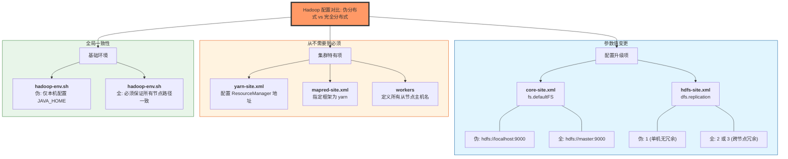


**各配置文件修改节点说明**

| 配置文件          | 在哪个节点修改                | 说明                                                         |
| ----------------- | ----------------------------- | ------------------------------------------------------------ |
| `core-site.xml`   | **Master**，然后 scp 到 Slave | 所有节点需要相同的 `fs.defaultFS` 地址                       |
| `hdfs-site.xml`   | **Master**，然后 scp 到 Slave | 所有节点需要相同的副本数和存储路径                           |
| `yarn-site.xml`   | **Master**，然后 scp 到 Slave | ResourceManager 在 Master；NodeManager 在 Slave 读取同一份配置去找 ResourceManager |
| `mapred-site.xml` | **Master**，然后 scp 到 Slave | 所有节点统一指定 MapReduce 框架为 yarn                       |
| `workers`         | **仅 Master**                 | 只有 Master 的启动脚本会读取此文件，用于知道 SSH 到哪些机器启动从节点进程 |
| `hadoop-env.sh`   | **Master**，然后 scp 到 Slave | 必须写死 `JAVA_HOME` 的具体路径（不能用 `$JAVA_HOME` 变量）  |

> **操作流程：** 步骤 3 在 Master 上修改所有文件 → 步骤 4 用 `scp -r` 整体复制到 Slave → Slave 上执行 `source ~/.bashrc`

**完全分布式搭建流程（Mermaid）**

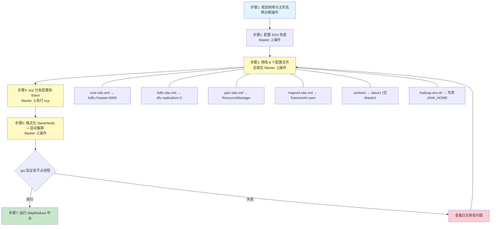


**伪分布式配置流程（Mermaid）**

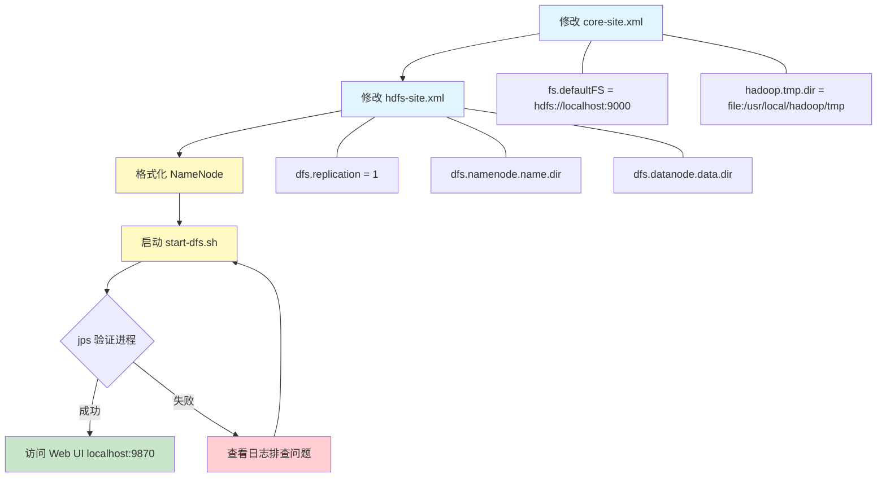


**Hadoop 伪分布式架构**

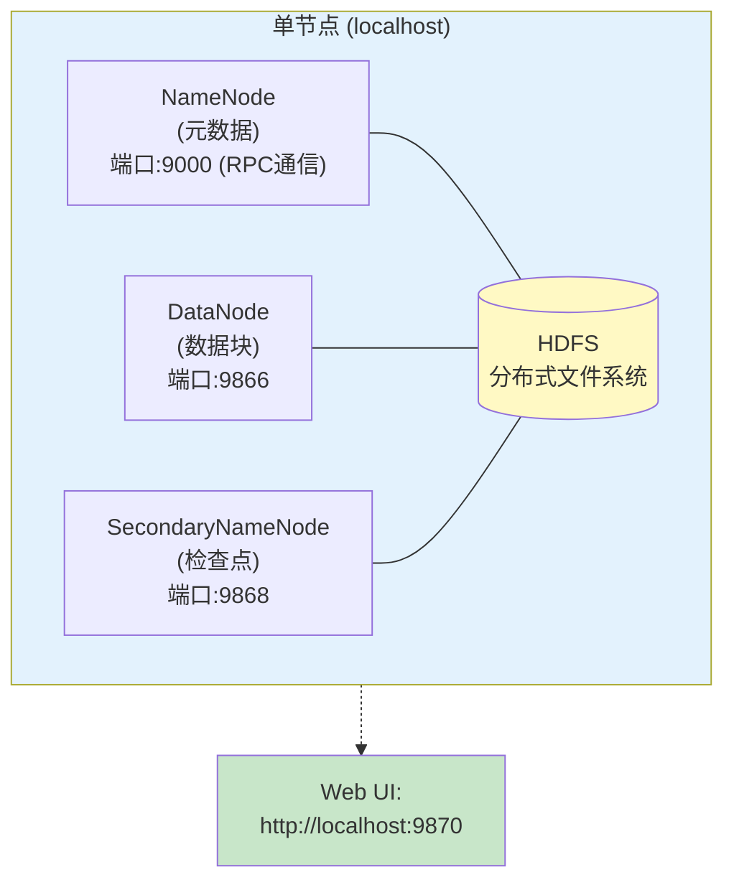


**关键配置文件对照表**

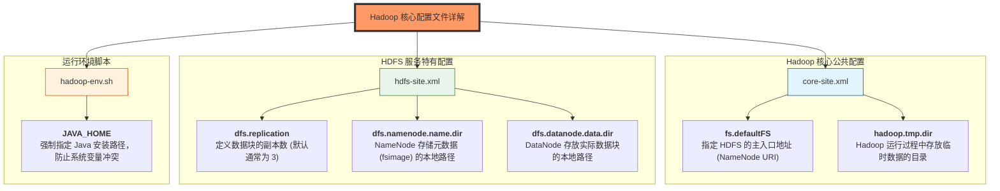


**HDFS 常用操作命令速查**

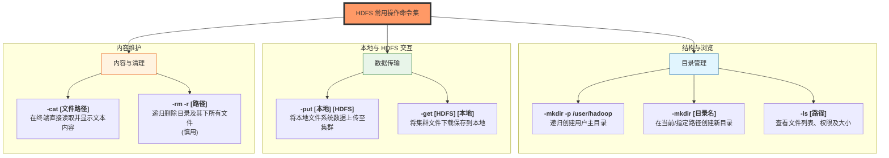


**启动与停止命令**

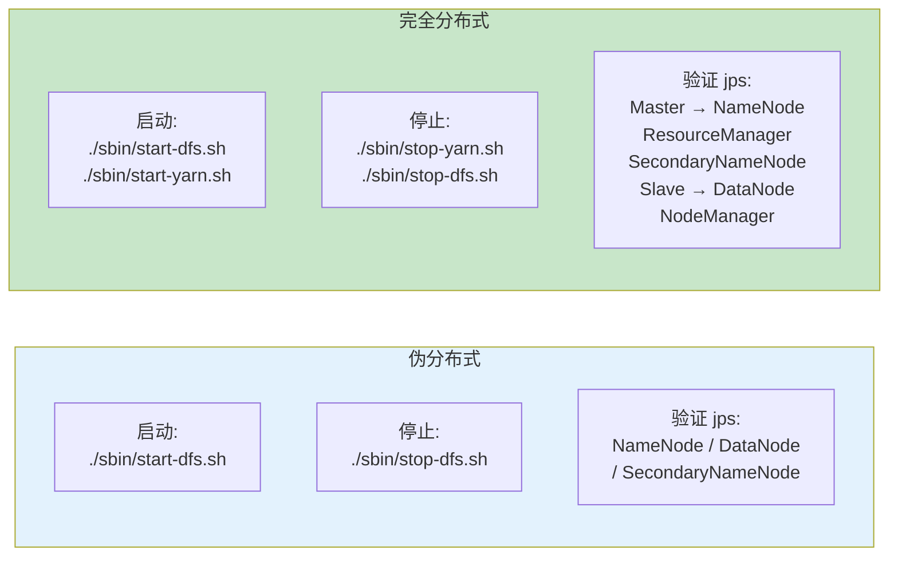


**Hadoop 完全分布式架构（Mermaid）**

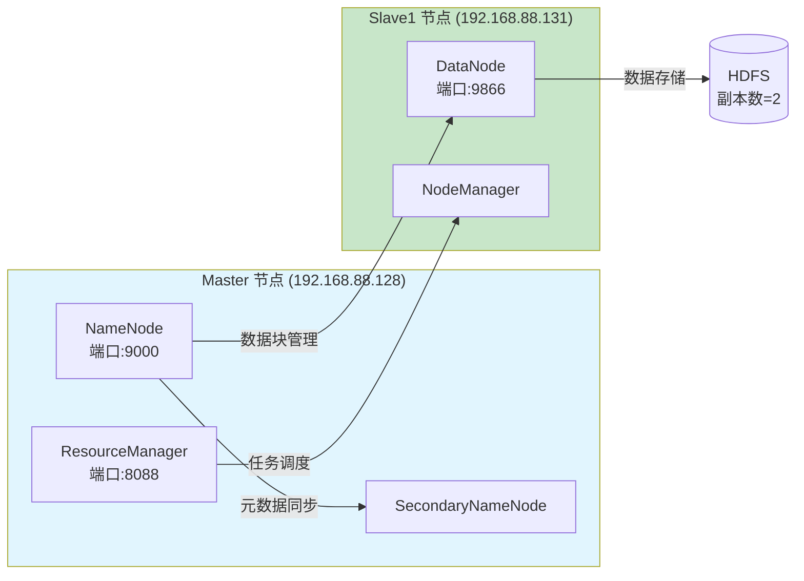


---


## 六、实验心得

通过本次实验，我完成了从 Linux 虚拟机安装到 Hadoop 完全分布式集群搭建的全过程。实验过程中遇到了许多问题，例如 SSH 免密登录配置、JAVA_HOME 环境变量设置、PID 文件残留导致启动失败等，通过查阅资料和反复调试逐一解决。

最大的收获是对 Hadoop 的架构有了更深入的理解：伪分布式模式下所有进程运行在同一台机器上，而完全分布式模式下 NameNode、ResourceManager 运行在 Master，DataNode、NodeManager 运行在 Slave，通过 SSH 和网络通信协调工作。配置文件的修改（如 `core-site.xml` 中的 `fs.defaultFS` 从 `localhost` 改为 `master`）体现了从单机到分布式的关键变化。

此外，实验中积累的排错经验（如查看日志、清理 PID 文件、检查 SSH 配置）对今后的系统运维工作有很大帮助。


